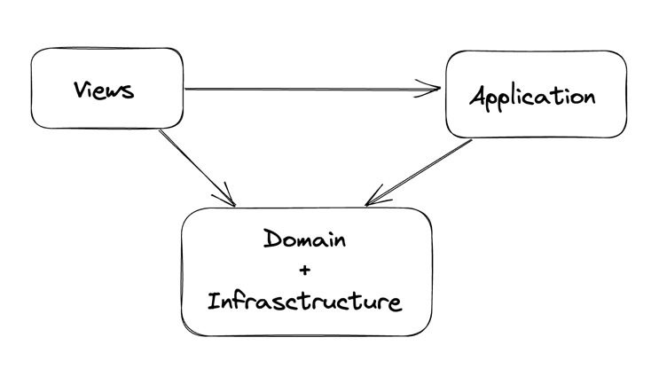

# Easy Course

## Table of contents
* [General info](#general-info)
* [Technologies](#technologies)
* [For user](#for-user)
* [Infrastructure](#infrastructure)
* [Project Setup](#project-setup)

# General Info

"Easy Course" is a simple and cozy studying app for everyone! Here you can find courses and lessons you're interested in easily.

## Technologies

For the developing process were used:

- Javascript 
- Vue3 Composition Api
- Pinia (version 2.0.32) as a state manager
- hls.js (version 1.3.4) for player
- axios (version 1.3.4) as HTTP client
- Tailwind CSS (version 3.2.7) for UI components
- Vitest (version 0.29.3) for testing

## For user

- Choose the course, which description and video preview you liked the most, from the list (don't forget to check all the pages!)
- Go to course page. There's all necessary info about course and lessons
- Choose the lesson you like (some of them are locked - you'll be warned about that) and open the video
- Don't worry, the progress of each lesson in always saved. Moreover, you can go to PiP mode or regulate the speed using your keyboard

# Infrastructure

Infrastructure in this context means different layers of application, defines how they relate to each other

### General scheme of the app



#### Meaning of arrows

A --> B means that A depends on B

### Description

I defined 3 main layers in my project: views, application, domain + infrastructure (I consider that it's one layer)

1) Views - components, that contain minimum of business logic, can communicate with store

    - presentation (ui, modals, common components - don't depend on context a lot, have their own functions)
    - container and structural components - example: Coursecard component - creates the structure of certain block

2) Application - the glue code that puts together the entire application (for example, pages(called views in the project )), these elements also know about store

3) Domain + Infrastructure - one layer in my case

    - stores - they contain all business logic, make all http requests and manage states

## Project Setup

To run this project, install it locally using npm:

```sh
npm install
```

To add the library of components locally run:

```sh
npm link error-handler-lib
```

### Compile

```sh
npm run dev
```
